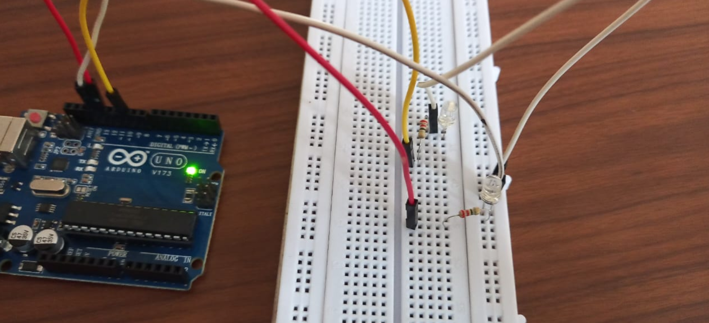

# XOR Encryption with Arduino LEDs
This Arduino project demonstrates a basic XOR encryption and decryption scheme using two LEDs to visually represent the encrypted binary output. It serves as an educational tool to understand bitwise XOR operations and binary data visualization via hardware.

# Overview
This project encrypts plaintext input using a password through XOR operation at a binary level. The encrypted output — a ciphertext in binary format — is then represented by blinking two LEDs connected to the Arduino:

LED on Pin 13 indicates binary 0.

LED on Pin 8 indicates binary 1.

The ciphertext is also printed on the Serial Monitor along with the plaintext, password, and their binary forms. Additionally, the ciphertext is decrypted back to the original plaintext to verify correctness.

# Components Required
Arduino Uno (or compatible board)

Breadboard

2 LEDs (e.g., one red, one green)

2 Resistors (220Ω or 330Ω recommended)

Jumper wires

# Circuit Diagram

Connect the first LED's anode to digital pin 13 on Arduino through a resistor; cathode to GND.

Connect the second LED's anode to digital pin 8 through a resistor; cathode to GND.

# Code Explanation
## Key Functions
xorEncrypt(String text, String key)
Converts each character of text and key to binary and performs XOR on corresponding bits, producing a binary ciphertext string.

### xorDecrypt(String text, String key)
Takes the binary ciphertext and re-applies XOR with the key (also in binary) to recover the original text.

### adjustPassword(String key, int length)
Repeats or truncates the password to match the length of the plaintext for correct bitwise XOR.

### toBinaryString(String text)
Converts a textual string into a spaced binary string for display and XOR processes.

### displayBinary(char c)
Controls the two LEDs to blink representing binary '0' or '1' and outputs the bit to Serial Monitor.

## Program Flow
User inputs plaintext and password sequentially over the Arduino Serial Monitor.

Password is adjusted to match plaintext length.

XOR encryption generates binary ciphertext.

Ciphertext bits blink through LEDs representing binary values visually.

Ciphertext is decrypted and matched to the original plaintext.

Success or error message prints on Serial Monitor.

# How to Use
Upload the xor_encryption.ino sketch to your Arduino.

Open the Serial Monitor at 9600 baud.

Enter the plaintext message and press Enter.

Enter the password/key and press Enter.

Observe the two LEDs blinking representing encrypted binary.

Check Serial Monitor for plaintext, password, binary forms, ciphertext, and encryption/decryption status.

# Notes & Improvements
The password length is automatically looped to match the plaintext length.

Timing delays control LED blink visibility; you may adjust delay(50) for faster/slower blinking.

The program currently supports ASCII text input only.

This project is designed for educational purposes and does not provide cryptographic security for real applications.

# License
This project is open-source and free to use for educational and personal purposes.

If you have questions or want to suggest improvements, feel free to contact or fork the repository. Enjoy exploring bitwise XOR encryption with Arduino!
